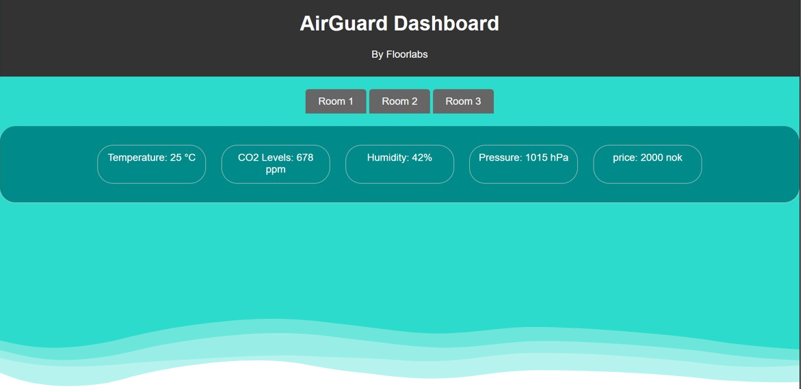

  
  
  

<h1 align="center">
  💨
  AirGuard
  💨
</h1>

---  

## Features
- Sender kontinuerlig luftkvalitetsdata til en brukervennlig nettside.
- Overvåker strømprisene for optimal ventilasjonsstyring.
- Automatisk tilpasning til ventilasjonssystemet forbedrer inneklimaet.

## Demo

## Usage
1.  Legg til ønskede sensorer.
2.  Endre nettsiden for å matche de tilkoblede sensorene.
3.  Skriv inn navn på nettverket og passord.
4.  Koble opp en ESP32 og last opp skriptet.  
    
---
  
Husk å installere nødvendige bibliotek.

Laget av Albert, Iver, Mikkel, og Oliver

## Sources

 
